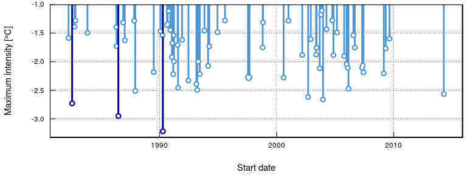
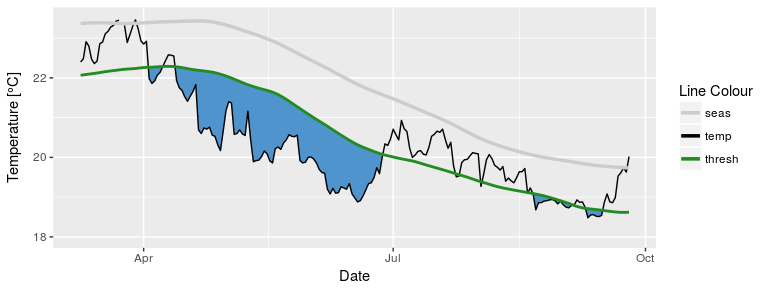
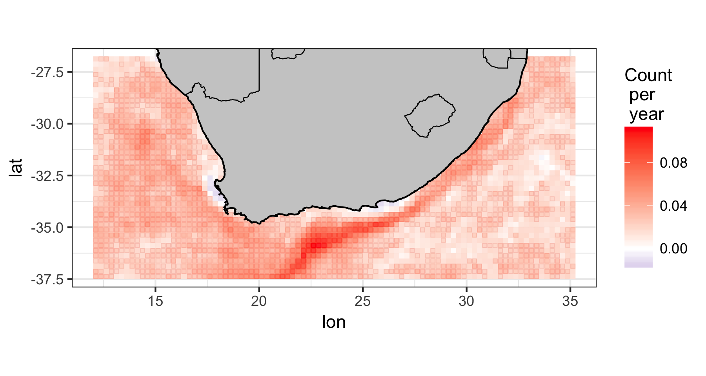
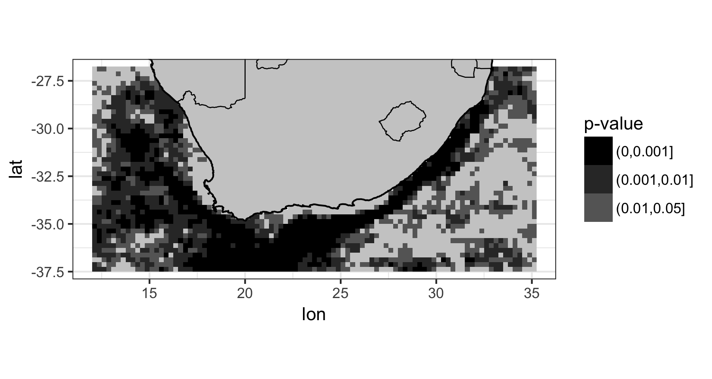

RmarineHeatWaves
================

[](https://cran.r-project.org/package=RmarineHeatWaves) [](https://travis-ci.org/ajsmit/RmarineHeatWaves) 

The **RmarineHeatWaves** package is a translation of the original Python code written by Eric C. J. Oliver that can be found on [GitHub](https://github.com/ecjoliver/marineHeatWaves).

The **RmarineHeatWaves** R package contains a number of functions which calculate and display marine heat waves according to the definition of Hobday et al. (2016). The marine cold spell option was implemented in version 0.13 (21 Nov 2015) of the Python module as a result of the preparation of Schlegel et al. (2017), wherein the cold events are introduced and briefly discussed.

This package may be found on [CRAN](https://cran.r-project.org/package=RmarineHeatWaves). Alternatively, you can install it from GitHub by issuing the following command:

`devtools::install_github("ajsmit/RmarineHeatWaves")`

The functions
=============

<table style="width:47%;">
<colgroup>
<col width="30%" />
<col width="16%" />
</colgroup>
<thead>
<tr class="header">
<th>Function</th>
<th>Description</th>
</tr>
</thead>
<tbody>
<tr class="odd">
<td><code>detect()</code></td>
<td>The main function which detects the events as per the definition of Hobday et al. (2016).</td>
</tr>
<tr class="even">
<td><code>make_whole()</code></td>
<td>Constructs a continuous, uninterrupted time series of temperatures.</td>
</tr>
<tr class="odd">
<td><code>block_average()</code></td>
<td>Calculates annual means for event metrics.</td>
</tr>
<tr class="even">
<td><code>event_line()</code></td>
<td>Creates a line plot of marine heat waves or cold spells.</td>
</tr>
<tr class="odd">
<td><code>lolli_plot()</code></td>
<td>Creates a timeline of selected event metrics.</td>
</tr>
<tr class="even">
<td><code>exceedance()</code></td>
<td>A function similar to <code>detect()</code> but that detects consecutive days above/below a given threshold.</td>
</tr>
<tr class="odd">
<td><code>geom_flame()</code></td>
<td>Creates flame polygons of marine heat waves or cold spells.</td>
</tr>
<tr class="even">
<td><code>geom_lolli()</code></td>
<td>Creates a lolliplot timeline of selected event metric.</td>
</tr>
</tbody>
</table>

The package also provides data of observed SST records for three historical MHWs: the 2011 Western Australia event, the 2012 Northwest Atlantic event and the 2003 Mediterranean event.

The heat wave metrics
---------------------

The function will return a list of two tibbles (see the 'tidyverse'), `clim` and `event`, which are the climatology and MHW (or MCS) events, respectively. The climatology contains the full time series of daily temperatures, as well as the the seasonal climatology, the threshold and various aspects of the events that were detected. The software was designed for detecting extreme thermal events, and the units specified below reflect that intended purpose. However, the various other kinds of extreme events may be detected according to the 'marine heat wave' specifications, and if that is the case, the appropriate units need to be determined by the user.

`doy` --- Julian day (day-of-year). For non-leap years it runs 1...59 and 61...366, while leap years run 1...366. This column will be named differently if another name was specified to the `doy` argument. `t` --- The date of the temperature measurement. This column will be named differently if another name was specified to the `x` argument. `temp` --- If the software was used for the purpose for which it was designed, seawater temperature \[deg. C\] on the specified date will be returned. This column will of course be named differently if another kind of measurement was specified to the `y` argument. `seas_clim_year` --- Climatological seasonal cycle \[deg. C\]. `thresh_clim_year` --- Seasonally varying threshold (e.g., 90th percentile) \[deg. C\]. `var_clim_year` --- Seasonally varying variance (standard deviation) \[deg. C\]. `thresh_criterion` --- Boolean indicating if `temp` exceeds `thresh_clim_year`. `duration_criterion` --- Boolean indicating whether periods of consecutive `thresh_criterion` are &gt;= `min_duration`. `event` --- Boolean indicating if all criteria that define a MHW or MCS are met. `event_no` --- A sequential number indicating the ID and order of occurence of the MHWs or MCSs.

The events are summarised using a range of event metrics: `index_start` --- Start index of event. `index_stop` --- Stop index of event. `event_no` --- A sequential number indicating the ID and order of the events. `duration` --- Duration of event \[days\]. `date_start` --- Start date of event \[date\]. `date_stop` --- Stop date of event \[date\]. `date_peak` --- Date of event peak \[date\]. `int_mean` --- Mean intensity \[deg. C\]. `int_max` --- Maximum (peak) intensity \[deg. C\]. `int_var` --- Intensity variability (standard deviation) \[deg. C\]. `int_cum` --- Cumulative intensity \[deg. C x days\]. `rate_onset` --- Onset rate of event \[deg. C / day\]. `rate_decline` --- Decline rate of event \[deg. C / day\].

`int_max_rel_thresh`, `int_mean_rel_thresh`, `int_var_rel_thresh`, and `int_cum_rel_thresh` are as above except relative to the threshold (e.g., 90th percentile) rather than the seasonal climatology.

`int_max_abs`, `int_mean_abs`, `int_var_abs`, and `int_cum_abs` are as above except as absolute magnitudes rather than relative to the seasonal climatology or threshold.

`int_max_norm` and `int_mean_norm` are as above except units are in multiples of threshold exceedances, i.e., a value of 1.5 indicates the event intensity (relative to the climatology) was 1.5 times the value of the threshold (relative to climatology, i.e., threshold - climatology.)

Note that `rate_onset` and `rate_decline` will return `NA` when the event begins/ends on the first/last day of the time series. This may be particularly evident when the function is applied to large gridded data sets. Although the other metrics do not contain any errors and provide sensible values, please take this into account in its interpretation.

The detection and graphing functions
------------------------------------

The `detect()` function is the package's core function. Here is the `detect()` function applied to the Western Australian test data, which are also discussed by Hobday et al. (2016):

``` r
library(RmarineHeatWaves); library(plyr); library(dplyr); library(ggplot2)
ts <- make_whole(sst_WA)
mhw <- detect(ts, climatology_start = 1983, climatology_end = 2012)
mhw$event %>% 
  dplyr::ungroup() %>%
  dplyr::select(event_no, duration, date_start, date_peak, int_mean, int_max, int_cum) %>% 
  dplyr::arrange(-int_cum) %>% 
  head(5)
#> # A tibble: 5 x 7
#>   event_no duration date_start date_peak  int_mean int_max int_cum
#>      <int>    <dbl> <date>     <date>        <dbl>   <dbl>   <dbl>
#> 1       22     95.0 1999-05-13 1999-05-22     2.50    3.60   237  
#> 2       42     60.0 2011-02-06 2011-02-28     3.21    6.51   193  
#> 3       49     47.0 2012-01-11 2012-01-27     2.23    3.30   105  
#> 4       50     46.0 2012-03-01 2012-04-10     1.99    2.96    91.7
#> 5       41     40.0 2010-12-24 2011-01-28     2.16    3.27    86.3
```

The corresponding `event_line()` and `lolli_plot()`, which represent the massive Western Australian heatwave of 2011, look like this:

``` r
event_line(mhw, spread = 200, metric = "int_cum",
           start_date = "2010-10-01", end_date = "2011-08-30")
```


``` r
lolli_plot(mhw)
```


The `event_line()` and `lolli_plot()` functions were designed to work directly on one of the list returned by `detect()`. If more control over the figures is required, it may be useful to create them in **ggplot2** by stacking 'geoms'. We specifically created two new **ggplot2** geoms to reproduce the functionality of `event_line()` and `lolli_plot()`. These functions are more general in their functionality and can be used outside of the **RmarineHeatWave** package too. To apply them to MHWs and MCSs, they require that we access the `clim` or `event` data frames within the list that is produced by `detect()`. Here is how:

``` r
mhw2 <- mhw$clim # find the climatology dataframe
mhw2 <- mhw2[10580:10690,] # identify the region of the time series of interest

ggplot(mhw2, aes(x = t, y = temp, y2 = thresh_clim_year)) +
  geom_flame() +
  geom_text(aes(x = as.Date("2011-02-01"), y = 28, label = "The MHW that launched\na thousand papers."))

ggplot(mhw$event, aes(x = date_start, y = int_max)) +
  geom_lolli(colour = "salmon", colour.n = "red", n = 3) +
  geom_text(aes(x = as.Date("2006-10-01"), y = 5,
                label = "The distribution of events\nis skewed towards the\nend of the time series."),
            colour = "black")
```

The default output of these function may not be to your liking. If so, not to worry. As **ggplot2** geoms, they are highly maleable. For example, if we were to choose to reproduce the format of the MHWs as seen in Hobday et al. (2016), the code would look something like this:

``` r
# It is necessary to give geom_flame() at least one row on either side of the event in order to calculate the polygon corners smoothly
mhw_top <- mhw2[49:110,]

ggplot(data = mhw2, aes(x = t)) +
  geom_flame(aes(y = temp, y2 = thresh_clim_year, fill = "all"), show.legend = T) +
  geom_flame(data = mhw_top, aes(y = temp, y2 = thresh_clim_year, fill = "top"), show.legend = T) +
  geom_line(aes(y = temp, colour = "temp")) +
  geom_line(aes(y = thresh_clim_year, colour = "thresh"), size = 1.0) +
  geom_line(aes(y = seas_clim_year, colour = "seas"), size = 1.2) +
  scale_colour_manual(name = "Line Colour",
                      values = c("temp" = "black", "thresh" =  "forestgreen", "seas" = "grey80")) +
  scale_fill_manual(name = "Event Colour", values = c("all" = "salmon", "top" = "red")) +
  guides(colour = guide_legend(override.aes = list(fill = NA))) +
  xlab("Date") +
  ylab(expression(paste("Temperature [", degree, "C]")))
```


Conversely, should we not wish to highlight any events with `geom_lolli()`, it would look like this:

``` r
# Note that this is accomplished by setting 'colour.n = NA', not by setting 'n = 0'.
ggplot(mhw$event, aes(x = date_start, y = int_cum)) +
  geom_lolli(colour = "salmon", n = 3, colour.n = NA)
```


The calculation and visualisation of marine cold spells is also accommodated within this package. Here is a cold spell detected in the OISST data for Western Australia:

``` r
mcs <- detect(ts, climatology_start = 1983, climatology_end = 2012, cold_spells = TRUE)
mcs$event %>% 
  dplyr::ungroup() %>%
  dplyr::select(event_no, duration, date_start, date_peak, int_mean, int_max, int_cum) %>% 
  dplyr::arrange(int_cum) %>% 
  head(5)
#> # A tibble: 5 x 7
#>   event_no duration date_start date_peak  int_mean int_max int_cum
#>      <int>    <dbl> <date>     <date>        <dbl>   <dbl>   <dbl>
#> 1       16     76.0 1990-04-13 1990-05-11    -2.54   -3.22  -193  
#> 2       54     58.0 2003-12-19 2004-01-23    -1.80   -2.66  -104  
#> 3       71     52.0 2014-04-14 2014-05-05    -1.82   -2.57  - 94.6
#> 4        8     38.0 1986-06-24 1986-07-17    -2.01   -2.95  - 76.4
#> 5       51     32.0 2003-09-08 2003-09-16    -1.56   -2.12  - 49.9
```

The plots showing the marine cold spells look like this:

``` r
# this function needs to be updated as it currently only works when 't' is the column name for date
event_line(mcs, spread = 200, metric = "int_cum",
           start_date = "1990-01-01", end_date = "1990-08-30")

lolli_plot(mcs)
```

 

Cold spell figures may be created as geoms in **ggplot2**, too:

``` r
mcs2 <- mcs$clim
mcs2 <- mcs2[2990:3190,]

# # Note that the plot centres on the polygons, so it may be necessary to manually zoom out a bit
ggplot(data = mcs2, aes(x = t)) +
  geom_flame(aes(y = thresh_clim_year, y2 = temp), fill = "steelblue3", show.legend = F) +
  geom_line(aes(y = temp, colour = "temp")) +
  geom_line(aes(y = thresh_clim_year, colour = "thresh"), size = 1.0) +
  geom_line(aes(y = seas_clim_year, colour = "seas"), size = 1.2) +
  scale_colour_manual(name = "Line Colour",
                      values = c("temp" = "black", "thresh" =  "forestgreen", "seas" = "grey80")) +
  scale_y_continuous(limits = c(18, 23.5)) +
  xlab("Date") +
  ylab(expression(paste("Temperature [", degree, "C]")))

ggplot(mcs$event, aes(x = date_start, y = int_cum)) +
  geom_lolli(colour = "steelblue3", colour.n = "navy", n = 7) +
  xlab("Date") +
  ylab(expression(paste("Cumulative intensity [days x ", degree, "C]")))
```

 

The exceedance function
-----------------------

In addition to the calculation of extreme events, consecutive days over a given static threshold may be calculated with the `exceedance()` function.

``` r
exc <- exceedance(ts, threshold = 25)
exc$exceedance %>%
  ungroup() %>%
  select(exceedance_no, duration, date_start, date_peak, int_mean, int_cum) %>%
  dplyr::arrange(-int_cum) %>%
  head(5)
#>   exceedance_no duration date_start  date_peak  int_mean   int_cum
#> 1             7       52 2011-02-08 2011-02-28 1.6740379 87.049969
#> 2             6       25 2008-04-03 2008-04-14 0.9799994 24.499985
#> 3            10       41 2012-03-03 2012-04-10 0.4385360 17.979977
#> 4             2       17 1999-05-13 1999-05-22 0.8558818 14.549990
#> 5             5       10 2000-05-03 2000-05-04 0.6969994  6.969994
```

The same function may be used to calculate consecutive days below a threshold, too.

``` r
exc <- exceedance(ts, threshold = 19, below = TRUE)
exc$exceedance %>%
  dplyr::ungroup() %>%
  dplyr::select(exceedance_no, duration, date_start, date_peak, int_mean, int_cum) %>%
  dplyr::arrange(int_cum) %>%
  head(5)
#>   exceedance_no duration date_start  date_peak   int_mean   int_cum
#> 1            17       46 2003-09-06 2003-09-16 -0.6008700 -27.64002
#> 2            16       31 2002-09-08 2002-09-25 -0.8480649 -26.29001
#> 3            13       24 1997-09-03 1997-09-15 -0.7691671 -18.46001
#> 4            20       25 2005-09-26 2005-10-12 -0.5420004 -13.55001
#> 5            12       18 1997-08-13 1997-08-22 -0.6944449 -12.50001
```

Working with gridded SST data
=============================

We can also load the gridded 0.25 degree Reynolds [OISST data](https://www.ncei.noaa.gov/thredds/blended-global/oisst-catalog.html) and apply the function pixel by pixel over all of the days of data. The example data used here have 93 longitude steps, 43 latitude steps, and cover 12797 days (1981 to 2016). We apply the `detect()` function to these data, fit a generalised linear model (GLM), and then plot the trend per decade of the marine heatwave count. In other words, have marine heatwaves become more or less frequent in recent years? Under climate change we can expect that extreme events would tend to occur more frequently and be of greater intensity. Indeed, we can clearly see in the figure below of the result of the GLM, how the Agulhas Current has been experiencing marine heat waves more frequently in recent decades. But there are two smaller areas, one along the western side of the Cape Peninsula in the Benguela Upwelling system and another around the Eastern Cape Province near Algoa Bay, where the frequency of marine heat waves seems to have actually been decreasing -- although the *P*-value of the decreasing trend is &gt; 0.05, and therefore not significant.





Please read the package [vignette](https://github.com/ajsmit/RmarineHeatWaves/blob/master/vignettes/gridded-event-detection.Rmd) to see how to load a netCDF file with the OISST data, apply the RmarineHeatWaves function to the whole 3D array of data, and then fit the GLM and plot the data.

References
==========

Hobday, A.J. et al. (2016). A hierarchical approach to defining marine heatwaves, Progress in Oceanography, 141, pp. 227-238.

Schlegel, R. W., Oliver, E. C. J., Wernberg, T. W., Smit, A. J. (2017). Coastal and offshore co-occurrences of marine heatwaves and cold-spells. Progress in Oceanography, 151, pp. 189-205.

Acknowledgements
================

The Python code was written by Eric C. J. Oliver.

Contributors to the Marine Heatwaves definition and its numerical implementation include Alistair J. Hobday, Lisa V. Alexander, Sarah E. Perkins, Dan A. Smale, Sandra C. Straub, Jessica Benthuysen, Michael T. Burrows, Markus G. Donat, Ming Feng, Neil J. Holbrook, Pippa J. Moore, Hillary A. Scannell, Alex Sen Gupta, and Thomas Wernberg.

The translation from Python to R was done by A. J. Smit and the graphing functions were contributed to by Robert. W. Schlegel.

Contact
=======

A. J. Smit Department for Biodiversity & Conservation Biology, University of the Western Cape, Private Bag X17, Bellville 7535, South Africa, E-mail: <ajsmit@uwc.ac.za>, Work tel.: +27 (0)21 959 3783
