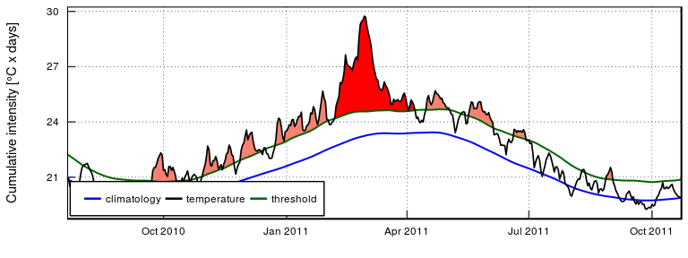
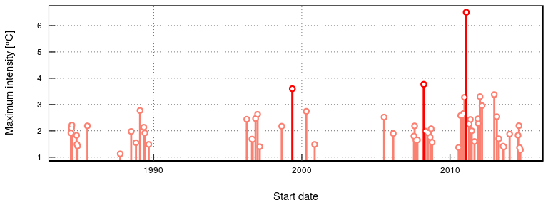
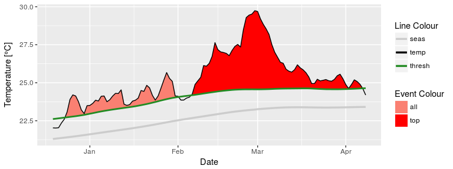
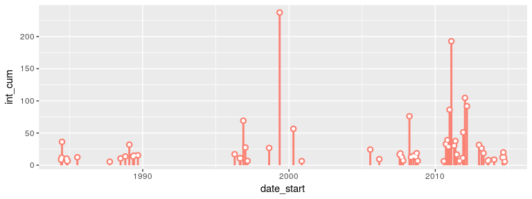
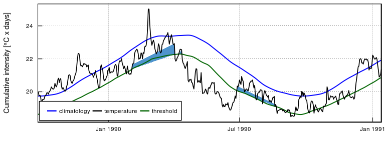
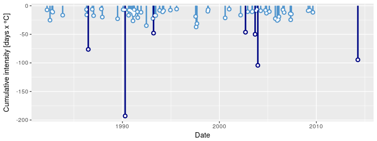

RmarineHeatWaves
================

[](https://cran.r-project.org/package=RmarineHeatWaves) [](https://travis-ci.org/ajsmit/RmarineHeatWaves) 

The **RmarineHeatWaves** package is a translation of the original Python code written by Eric C. J. Oliver that can be found on [GitHub](https://github.com/ecjoliver/marineHeatWaves).

The **RmarineHeatWaves** R package contains a number of functions which calculate and display marine heat waves according to the definition of Hobday et al. (2016). The marine cold spell option was implemented in version 0.13 (21 Nov 2015) of the Python module as a result of the preparation of Schlegel et al. (2017), wherein the cold events are introduced and briefly discussed.

This package may be found on [CRAN](https://cran.r-project.org/package=RmarineHeatWaves). Alternatively, you can install it from GitHub by issuing the following command:

`devtools::install_github("ajsmit/RmarineHeatWaves")`

The functions
=============

<table style="width:47%;">
<colgroup>
<col width="30%" />
<col width="16%" />
</colgroup>
<thead>
<tr class="header">
<th>Function</th>
<th>Description</th>
</tr>
</thead>
<tbody>
<tr class="odd">
<td><code>detect()</code></td>
<td>The main function which detects the events as per the definition of Hobday et al. (2016).</td>
</tr>
<tr class="even">
<td><code>make_whole()</code></td>
<td>Constructs a continuous, uninterrupted time series of temperatures.</td>
</tr>
<tr class="odd">
<td><code>block_average()</code></td>
<td>Calculates annual means for event metrics.</td>
</tr>
<tr class="even">
<td><code>event_line()</code></td>
<td>Creates a line plot of marine heat waves or cold spells.</td>
</tr>
<tr class="odd">
<td><code>lolli_plot()</code></td>
<td>Creates a timeline of selected event metrics.</td>
</tr>
<tr class="even">
<td><code>exceedance()</code></td>
<td>A function similar to <code>detect()</code> but that detects consecutive days above/below a given threshold.</td>
</tr>
<tr class="odd">
<td><code>geom_flame()</code></td>
<td>Creates flame polygons of marine heat waves or cold spells.</td>
</tr>
<tr class="even">
<td><code>geom_lolli()</code></td>
<td>Creates a lolliplot timeline of selected event metric.</td>
</tr>
</tbody>
</table>

The package also provides data of observed SST records for three historical MHWs: the 2011 Western Australia event, the 2012 Northwest Atlantic event and the 2003 Mediterranean event.

The detection and graphing functions
------------------------------------

The `detect()` function is the package's core function. Here is the `detect()` function applied to the Western Australian test data, which are also discussed by Hobday et al. (2016):

``` r
library(RmarineHeatWaves); library(plyr); library(dplyr); library(ggplot2)
ts <- make_whole(sst_WA)
mhw <- detect(ts, climatology_start = 1983, climatology_end = 2012)
mhw$event %>% 
  ungroup() %>%
  select(event_no, duration, date_start, date_peak, int_mean, int_max, int_cum) %>% 
  dplyr::arrange(-int_cum)
#>    event_no duration date_start  date_peak int_mean  int_max    int_cum
#> 1        22       95 1999-05-13 1999-05-22 2.498305 3.601700 237.339002
#> 2        42       60 2011-02-06 2011-02-28 3.211903 6.505969 192.714196
#> 3        49       47 2012-01-11 2012-01-27 2.225734 3.300112 104.609485
#> 4        50       46 2012-03-01 2012-04-10 1.993709 2.957609  91.710613
#> 5        41       40 2010-12-24 2011-01-28 2.157016 3.274803  86.280641
#> 6        31       34 2008-03-26 2008-04-14 2.236577 3.769274  76.043631
#> 7        18       38 1996-11-17 1996-12-21 1.820192 2.467469  69.167277
#> 8        23       29 2000-04-21 2000-05-04 1.949836 2.741701  56.545232
#> 9        48       29 2011-11-30 2011-12-19 1.760314 2.281731  51.049113
#> 10       39       24 2010-10-30 2010-11-03 1.623114 2.585006  38.954747
#> 11       44       19 2011-05-17 2011-05-26 1.979784 2.432942  37.615898
#> 12        3       19 1984-06-26 1984-07-10 1.909413 2.216489  36.278856
#> 13       38       18 2010-09-23 2010-09-29 1.819194 2.580871  32.745483
#> 14       11       16 1989-01-31 1989-02-03 1.996906 2.771187  31.950503
#> 15       51       14 2012-12-27 2012-12-31 2.256281 3.378625  31.587928
#> 16       43       17 2011-04-16 2011-04-22 1.787959 2.258341  30.395309
#> 17       40       15 2010-11-28 2010-12-02 1.913794 2.656340  28.706910
#> 18       19       14 1997-01-07 1997-01-09 1.965577 2.628349  27.518072
#> 19       21       20 1998-08-24 1998-09-08 1.337545 2.176428  26.750900
#> 20       52       14 2013-03-01 2013-03-09 1.865526 2.537570  26.117362
#> 21       25       14 2005-07-22 2005-07-25 1.738173 2.520733  24.334417
#> 22       58       12 2014-08-27 2014-08-31 1.664334 2.195177  19.972012
#> 23       53       13 2013-04-18 2013-04-30 1.434600 1.700723  18.649800
#> 24       35       12 2008-09-23 2008-09-29 1.550866 2.080871  18.610390
#> 25       28       12 2007-08-13 2007-08-17 1.530792 2.187102  18.369504
#> 26       15       10 1996-04-15 1996-04-18 1.707352 2.441142  17.073520
#> 27       45        9 2011-06-20 2011-06-27 1.840058 2.001329  16.560518
#> 28       27       11 2007-07-27 2007-08-04 1.500467 1.800800  16.505133
#> 29       14       13 1989-09-02 1989-09-10 1.183285 1.486415  15.382711
#> 30       13        9 1989-05-29 1989-06-06 1.660146 1.917156  14.941311
#> 31       33        8 2008-07-03 2008-07-06 1.799150 1.929231  14.393199
#> 32       12        7 1989-05-04 1989-05-06 1.940823 2.137756  13.585758
#> 33       10       11 1988-10-23 1988-10-25 1.231473 1.550684  13.546203
#> 34       34       10 2008-08-30 2008-09-03 1.316505 1.757651  13.165053
#> 35       29        9 2007-09-16 2007-09-21 1.390591 1.649702  12.515318
#> 36       32        7 2008-05-07 2008-05-10 1.785558 1.989278  12.498903
#> 37        7        7 1985-07-14 1985-07-17 1.766518 2.189464  12.365629
#> 38       59       10 2014-09-11 2014-09-18 1.225963 1.364830  12.259633
#> 39       57        9 2014-08-06 2014-08-12 1.340318 1.830038  12.062862
#> 40        2        6 1984-06-17 1984-06-19 1.985059 2.106284  11.910355
#> 41       47        6 2011-11-21 2011-11-23 1.872833 2.455965  11.236996
#> 42       17        8 1996-09-08 1996-09-11 1.353343 1.675421  10.826741
#> 43       16        8 1996-08-21 1996-08-24 1.332139 1.687321  10.657108
#> 44        9        6 1988-06-27 1988-06-28 1.742124 1.977335  10.452747
#> 45        4        7 1984-10-19 1984-10-23 1.462561 1.830392  10.237928
#> 46       26        6 2006-03-05 2006-03-07 1.562651 1.898369   9.375908
#> 47       56        5 2014-01-10 2014-01-11 1.733698 1.876055   8.668490
#> 48        1        5 1984-06-03 1984-06-05 1.704155 1.921768   8.520774
#> 49       55        7 2013-08-21 2013-08-24 1.127502 1.387321   7.892516
#> 50       30        5 2007-10-22 2007-10-24 1.421099 1.655897   7.105496
#> 51       36        5 2008-10-19 2008-10-20 1.340269 1.566182   6.701347
#> 52        6        5 1984-11-13 1984-11-14 1.336727 1.425640   6.683636
#> 53       54        5 2013-08-03 2013-08-05 1.328319 1.417800   6.641595
#> 54       20        5 1997-03-01 1997-03-01 1.326986 1.398588   6.634931
#> 55       46        5 2011-08-28 2011-08-31 1.325094 1.595177   6.625471
#> 56        5        5 1984-10-29 1984-10-30 1.303361 1.488716   6.516807
#> 57       24        5 2000-11-13 2000-11-14 1.276727 1.485640   6.383636
#> 58       37        5 2010-08-02 2010-08-05 1.259116 1.367800   6.295581
#> 59       60        5 2014-10-01 2014-10-04 1.127285 1.277626   5.636426
#> 60        8        5 1987-10-01 1987-10-04 1.089285 1.127626   5.446426
```

The corresponding `event_line()` and `lolli_plot()`, which represent the massive Western Australian heatwave of 2011, look like this:

``` r
event_line(mhw, spread = 200, metric = "int_cum",
           start_date = "2010-10-01", end_date = "2011-08-30")
```



``` r
lolli_plot(mhw)
```



The `event_line()` and `lolli_plot()` functions were designed to work directly on one of the list returned by `detect()`. If more control over the figures is required, it may be useful to create them in **ggplot2** by stacking 'geoms'. We specifically created two new **ggplot2** geoms to reproduce the functionality of `event_line()` and `lolli_plot()`. These functions are more general in their functionality and can be used outside of the **RmarineHeatWave** package too. To apply them to MHWs and MCSs, they require that we access the `clim` or `event` data frames within the list that is produced by `detect()`. Here is how:

``` r
mhw2 <- mhw$clim # find the climatology dataframe
mhw2 <- mhw2[10580:10690,] # identify the region of the time series of interest

# ggplot(mhw2, aes(x = date, y = temp, y2 = thresh_clim_year)) +
#   geom_flame() +
#   geom_text(aes(x = as.Date("2011-02-01"), y = 28, label = "The MHW that launched\na thousand papers."))
# 
# ggplot(mhw$event, aes(x = date_start, y = int_max)) +
#   geom_lolli(colour = "salmon", colour.n = "red", n = 3) +
#   geom_text(aes(x = as.Date("2006-10-01"), y = 5, 
#                 label = "The distribution of events\nis skewed towards the\nend of the time series."),
#             colour = "black")
```

The default output of these function may not be to your liking. If so, not to worry. As **ggplot2** geoms, they are highly maleable. For example, if we were to choose to reproduce the format of the MHWs as seen in Hobday et al. (2016), the code would look something like this:

``` r
# It is necessary to give geom_flame() at least one row on either side of the event in order to calculate the polygon corners smoothly
mhw_top <- mhw2[49:110,]

ggplot(data = mhw2, aes(x = date)) +
  geom_flame(aes(y = temp, y2 = thresh_clim_year, fill = "all"), show.legend = T) +
  geom_flame(data = mhw_top, aes(y = temp, y2 = thresh_clim_year, fill = "top"), show.legend = T) +
  geom_line(aes(y = temp, colour = "temp")) +
  geom_line(aes(y = thresh_clim_year, colour = "thresh"), size = 1.0) +
  geom_line(aes(y = seas_clim_year, colour = "seas"), size = 1.2) +
  scale_colour_manual(name = "Line Colour",
                      values = c("temp" = "black", "thresh" =  "forestgreen", "seas" = "grey80")) +
  scale_fill_manual(name = "Event Colour", values = c("all" = "salmon", "top" = "red")) +
  guides(colour = guide_legend(override.aes = list(fill = NA))) +
  xlab("Date") +
  ylab(expression(paste("Temperature [", degree, "C]")))
```



Conversely, should we not wish to highlight any events with `geom_lolli()`, it would look like this:

``` r
# Note that this is accomplished by setting 'colour.n = NA', not by setting 'n = 0'.
ggplot(mhw$event, aes(x = date_start, y = int_cum)) +
  geom_lolli(colour = "salmon", n = 3, colour.n = NA)
```



The calculation and visualisation of marine cold spells is also accommodated within this package. Here is a cold spell detected in the OISST data for Western Australia:

``` r
mcs <- detect(ts, climatology_start = 1983, climatology_end = 2012, cold_spells = TRUE)
mcs$event %>% 
  ungroup() %>%
  select(event_no, duration, date_start, date_peak, int_mean, int_max, int_cum) %>% 
  dplyr::arrange(int_cum)
#>    event_no duration date_start  date_peak  int_mean   int_max     int_cum
#> 1        16       76 1990-04-13 1990-05-11 -2.538017 -3.218054 -192.889294
#> 2        54       58 2003-12-19 2004-01-23 -1.798455 -2.662320 -104.310382
#> 3        71       52 2014-04-14 2014-05-05 -1.818984 -2.565533  -94.587152
#> 4         8       38 1986-06-24 1986-07-17 -2.009802 -2.950536  -76.372481
#> 5        51       32 2003-09-08 2003-09-16 -1.560817 -2.116583  -49.946130
#> 6        31       28 1993-03-18 1993-04-11 -1.710159 -2.494210  -47.884442
#> 7        47       27 2002-09-11 2002-09-25 -1.714935 -2.618133  -46.303245
#> 8        40       22 1997-08-09 1997-08-22 -1.688167 -2.290205  -37.139665
#> 9        29       18 1992-06-20 1992-07-05 -1.934667 -2.329971  -34.823999
#> 10       41       18 1997-09-08 1997-09-15 -1.735893 -2.273214  -31.246073
#> 11       22       18 1991-02-02 1991-02-07 -1.469219 -1.675896  -26.445943
#> 12       60       17 2005-12-22 2006-01-03 -1.511504 -2.042070  -25.695566
#> 13        2       14 1982-07-13 1982-07-18 -1.803274 -2.730429  -25.245834
#> 14       66       14 2007-05-10 2007-05-14 -1.755831 -2.065088  -24.581628
#> 15       61       14 2006-01-30 2006-02-03 -1.721274 -2.108813  -24.097831
#> 16       13       12 1989-07-03 1989-07-08 -1.897434 -2.181969  -22.769212
#> 17       59       13 2005-10-08 2005-10-16 -1.728557 -1.902428  -22.471242
#> 18       30       14 1993-02-23 1993-02-26 -1.599100 -2.392413  -22.387400
#> 19       44       11 2000-08-06 2000-08-13 -1.933511 -2.279389  -21.268621
#> 20       27       12 1991-08-02 1991-08-03 -1.734623 -2.457996  -20.815479
#> 21       12        9 1987-12-04 1987-12-10 -2.206373 -2.513417  -19.857360
#> 22       62        9 2006-02-20 2006-02-23 -2.119604 -2.473923  -19.076438
#> 23       39       10 1997-07-22 1997-07-25 -1.875965 -2.269267  -18.759646
#> 24       10       12 1987-01-10 1987-01-19 -1.446028 -1.625851  -17.352339
#> 25       33        9 1993-06-08 1993-06-10 -1.894296 -2.215965  -17.048660
#> 26       32       10 1993-04-25 1993-04-30 -1.704012 -1.999277  -17.040124
#> 27       17       15 1990-08-21 1990-08-22 -1.109917 -1.360205  -16.648751
#> 28        5       14 1983-11-03 1983-11-12 -1.180625 -1.495424  -16.528751
#> 29       46       10 2002-03-11 2002-03-13 -1.642971 -1.884575  -16.429706
#> 30        7       10 1986-04-29 1986-04-30 -1.594830 -1.729277  -15.948298
#> 31       23        9 1991-03-02 1991-03-06 -1.732337 -2.219798  -15.591034
#> 32       67        8 2007-06-04 2007-06-07 -1.818714 -2.187081  -14.549712
#> 33       65        8 2007-04-25 2007-04-30 -1.737697 -2.109277  -13.901578
#> 34       57        9 2004-11-09 2004-11-11 -1.449763 -1.886676  -13.047867
#> 35       25        7 1991-03-25 1991-03-30 -1.774453 -1.995725  -12.421173
#> 36       64        8 2006-09-05 2006-09-07 -1.463964 -1.754825  -11.711714
#> 37       21        7 1991-01-21 1991-01-27 -1.652896 -1.919888  -11.570272
#> 38       70        8 2009-08-23 2009-08-26 -1.439695 -1.597460  -11.517559
#> 39       28        8 1991-12-03 1991-12-04 -1.429503 -1.619717  -11.436024
#> 40        4       11 1982-10-23 1982-10-30 -1.016709 -1.281283  -11.183796
#> 41       35        6 1994-02-23 1994-02-25 -1.789718 -2.074278  -10.738309
#> 42       49        7 2003-05-17 2003-05-18 -1.510161 -1.877312  -10.571125
#> 43       26        7 1991-07-18 1991-07-20 -1.494490 -1.708075  -10.461430
#> 44       48        8 2002-12-02 2002-12-08 -1.299533 -1.605519  -10.396267
#> 45       58        7 2005-02-25 2005-03-03 -1.455031 -1.488937  -10.185214
#> 46        3        8 1982-09-27 1982-09-29 -1.237784 -1.389129   -9.902273
#> 47       50        6 2003-05-31 2003-06-03 -1.638230 -1.757881   -9.829383
#> 48       42        7 1998-10-23 1998-10-27 -1.380074 -1.752113   -9.660516
#> 49       20        7 1990-12-01 1990-12-06 -1.304453 -1.446823   -9.131170
#> 50       55        7 2004-04-05 2004-04-11 -1.245348 -1.434210   -8.717433
#> 51       52        8 2003-10-14 2003-10-14 -1.085807 -1.179266   -8.686453
#> 52       68        5 2009-02-28 2009-03-02 -1.726477 -2.205102   -8.632385
#> 53       36        6 1994-03-31 1994-04-03 -1.424866 -1.732138   -8.549198
#> 54       34        7 1993-11-01 1993-11-03 -1.143218 -1.454994   -8.002526
#> 55       56        7 2004-10-03 2004-10-05 -1.132875 -1.277262   -7.930125
#> 56       19        8 1990-10-17 1990-10-24 -0.991118 -1.114103   -7.928944
#> 57       69        5 2009-04-28 2009-04-30 -1.542004 -1.769277   -7.710019
#> 58       18        6 1990-09-10 1990-09-10 -1.276079 -1.343585   -7.656473
#> 59       37        6 1994-12-13 1994-12-16 -1.273541 -1.484106   -7.641245
#> 60        1        5 1982-03-24 1982-03-24 -1.454247 -1.587685   -7.271234
#> 61       15        5 1990-04-03 1990-04-04 -1.405929 -1.536418   -7.029646
#> 62       63        5 2006-07-23 2006-07-25 -1.396467 -1.539267   -6.982337
#> 63       24        5 1991-03-17 1991-03-19 -1.395889 -1.540375   -6.979445
#> 64       14        5 1990-01-29 1990-02-01 -1.369539 -1.468102   -6.847694
#> 65       43        6 1998-11-04 1998-11-05 -1.123932 -1.314111   -6.743589
#> 66        6        5 1986-04-21 1986-04-25 -1.339205 -1.397620   -6.696023
#> 67        9        5 1986-11-22 1986-11-22 -1.251188 -1.315822   -6.255941
#> 68       53        6 2003-11-14 2003-11-15 -1.031229 -1.104681   -6.187374
#> 69       45        5 2001-01-05 2001-01-06 -1.201561 -1.283649   -6.007805
#> 70       38        5 1995-08-04 1995-08-04 -1.165846 -1.279200   -5.829229
#> 71       11        5 1987-10-30 1987-10-31 -1.111655 -1.283938   -5.558275
```

The plots showing the marine cold spells look like this:

``` r
event_line(mcs, spread = 200, metric = "int_cum",
           start_date = "1990-01-01", end_date = "1990-08-30")

lolli_plot(mcs)
```

 

Cold spell figures may be created as geoms in **ggplot2**, too:

``` r
mcs2 <- mcs$clim
mcs2 <- mcs2[2990:3190,]

# # Note that the plot centres on the polygons, so it may be necessary to manually zoom out a bit
ggplot(data = mcs2, aes(x = date)) +
  geom_flame(aes(y = thresh_clim_year, y2 = temp), fill = "steelblue3", show.legend = F) +
  geom_line(aes(y = temp, colour = "temp")) +
  geom_line(aes(y = thresh_clim_year, colour = "thresh"), size = 1.0) +
  geom_line(aes(y = seas_clim_year, colour = "seas"), size = 1.2) +
  scale_colour_manual(name = "Line Colour",
                      values = c("temp" = "black", "thresh" =  "forestgreen", "seas" = "grey80")) +
  scale_y_continuous(limits = c(18, 23.5)) +
  xlab("Date") +
  ylab(expression(paste("Temperature [", degree, "C]")))

ggplot(mcs$event, aes(x = date_start, y = int_cum)) +
  geom_lolli(colour = "steelblue3", colour.n = "navy", n = 7) +
  xlab("Date") +
  ylab(expression(paste("Cumulative intensity [days x ", degree, "C]")))
```

 

The exceedance function
-----------------------

In addition to the calculation of extreme events, consecutive days over a given static threshold may be calculated with the `exceedance()` function.

``` r
exc <- exceedance(ts, threshold = 25)
exc$exceedance %>% 
  ungroup() %>%
  select(exceedance_no, duration, date_start, date_peak, int_mean, int_max, int_cum) %>% 
  dplyr::arrange(-int_cum)
#>    exceedance_no duration date_start  date_peak  int_mean   int_max
#> 1              1        5 1989-05-05 1989-05-06 0.2859994 0.3599994
#> 2              2       17 1999-05-13 1989-05-06 0.2859994 0.3599994
#> 3              3        7 1999-06-02 1989-05-06 0.2859994 0.3599994
#> 4              4        6 2000-04-21 1989-05-06 0.2859994 0.3599994
#> 5              5       10 2000-05-03 1989-05-06 0.2859994 0.3599994
#> 6              6       25 2008-04-03 1989-05-06 0.2859994 0.3599994
#> 7              7       52 2011-02-08 1989-05-06 0.2859994 0.3599994
#> 8              8        9 2011-04-20 1989-05-06 0.2859994 0.3599994
#> 9              9        6 2012-02-08 1989-05-06 0.2859994 0.3599994
#> 10            10       41 2012-03-03 1989-05-06 0.2859994 0.3599994
#> 11            11       10 2013-03-02 1989-05-06 0.2859994 0.3599994
#>     int_cum
#> 1  1.429997
#> 2  1.429997
#> 3  1.429997
#> 4  1.429997
#> 5  1.429997
#> 6  1.429997
#> 7  1.429997
#> 8  1.429997
#> 9  1.429997
#> 10 1.429997
#> 11 1.429997
```

The same function may be used to calculate consecutive days below a threshold, too.

``` r
exc <- exceedance(ts, threshold = 19, below = TRUE)
exc$exceedance %>%
  ungroup() %>%
  select(exceedance_no, duration, date_start, date_peak, int_mean, int_max, int_cum) %>%
  dplyr::arrange(int_cum)
#>    exceedance_no duration date_start  date_peak   int_mean    int_max
#> 1              1       20 1982-09-15 1982-09-24 -0.4080004 -0.7600004
#> 2              2       17 1986-07-14 1982-09-24 -0.4080004 -0.7600004
#> 3              3        6 1987-09-06 1982-09-24 -0.4080004 -0.7600004
#> 4              4        6 1987-12-06 1982-09-24 -0.4080004 -0.7600004
#> 5              5       26 1990-08-22 1982-09-24 -0.4080004 -0.7600004
#> 6              6        8 1990-10-17 1982-09-24 -0.4080004 -0.7600004
#> 7              7       11 1991-08-02 1982-09-24 -0.4080004 -0.7600004
#> 8              8        8 1992-09-30 1982-09-24 -0.4080004 -0.7600004
#> 9              9        5 1992-10-15 1982-09-24 -0.4080004 -0.7600004
#> 10            10        8 1993-10-04 1982-09-24 -0.4080004 -0.7600004
#> 11            11        8 1997-07-23 1982-09-24 -0.4080004 -0.7600004
#> 12            12       18 1997-08-13 1982-09-24 -0.4080004 -0.7600004
#> 13            13       24 1997-09-03 1982-09-24 -0.4080004 -0.7600004
#> 14            14        6 1998-10-23 1982-09-24 -0.4080004 -0.7600004
#> 15            15       11 2000-08-06 1982-09-24 -0.4080004 -0.7600004
#> 16            16       31 2002-09-08 1982-09-24 -0.4080004 -0.7600004
#> 17            17       46 2003-09-06 1982-09-24 -0.4080004 -0.7600004
#> 18            18        8 2004-10-03 1982-09-24 -0.4080004 -0.7600004
#> 19            19        6 2004-11-09 1982-09-24 -0.4080004 -0.7600004
#> 20            20       25 2005-09-26 1982-09-24 -0.4080004 -0.7600004
#> 21            21        8 2006-09-05 1982-09-24 -0.4080004 -0.7600004
#> 22            22        8 2009-08-23 1982-09-24 -0.4080004 -0.7600004
#>      int_cum
#> 1  -8.160008
#> 2  -8.160008
#> 3  -8.160008
#> 4  -8.160008
#> 5  -8.160008
#> 6  -8.160008
#> 7  -8.160008
#> 8  -8.160008
#> 9  -8.160008
#> 10 -8.160008
#> 11 -8.160008
#> 12 -8.160008
#> 13 -8.160008
#> 14 -8.160008
#> 15 -8.160008
#> 16 -8.160008
#> 17 -8.160008
#> 18 -8.160008
#> 19 -8.160008
#> 20 -8.160008
#> 21 -8.160008
#> 22 -8.160008
```

Working with gridded SST data
=============================

We can also load the gridded 0.25 degree Reynolds [OISST data](https://www.ncei.noaa.gov/thredds/blended-global/oisst-catalog.html) and apply the function pixel by pixel over all of the days of data. The example data used here have 93 longitude steps, 43 latitude steps, and cover 12797 days (1981 to 2016). We apply the `detect()` function to these data, fit a generalised linear model (GLM), and then plot the trend per decade of the marine heatwave count. In other words, have marine heatwaves become more or less frequent in recent years? Under climate change we can expect that extreme events would tend to occur more frequently and be of greater intensity. Indeed, we can clearly see in the figure below of the result of the GLM, how the Agulhas Current has been experiencing marine heat waves more frequently in recent decades. But there are two smaller areas, one along the western side of the Cape Peninsula in the Benguela Upwelling system and another around the Eastern Cape Province near Algoa Bay, where the frequency of marine heat waves seems to have actually been decreasing -- although the *P*-value of the decreasing trend is &gt; 0.05, and therefore not significant.


Please read the package [vignette](https://github.com/ajsmit/RmarineHeatWaves/blob/master/vignettes/gridded-event-detection.Rmd) to see how to load a netCDF file with the OISST data, apply the RmarineHeatWaves function to the whole 3D array of data, and then fit the GLM and plot the data.

References
==========

Hobday, A.J. et al. (2016). A hierarchical approach to defining marine heatwaves, Progress in Oceanography, 141, pp. 227-238.

Schlegel, R. W., Oliver, E. C. J., Wernberg, T. W., Smit, A. J. (2017). Coastal and offshore co-occurrences of marine heatwaves and cold-spells. Progress in Oceanography, 151, pp. 189-205.

Acknowledgements
================

The Python code was written by Eric C. J. Oliver.

Contributors to the Marine Heatwaves definition and its numerical implementation include Alistair J. Hobday, Lisa V. Alexander, Sarah E. Perkins, Dan A. Smale, Sandra C. Straub, Jessica Benthuysen, Michael T. Burrows, Markus G. Donat, Ming Feng, Neil J. Holbrook, Pippa J. Moore, Hillary A. Scannell, Alex Sen Gupta, and Thomas Wernberg.

The translation from Python to R was done by A. J. Smit and the graphing functions were contributed to by Robert. W. Schlegel.

Contact
=======

A. J. Smit Department for Biodiversity & Conservation Biology, University of the Western Cape, Private Bag X17, Bellville 7535, South Africa, E-mail: <ajsmit@uwc.ac.za>, Work tel.: +27 (0)21 959 3783
